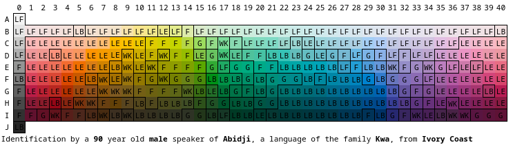

# World Color Survey Visualizer

View at https://zzggbb.github.io/world_color_survey/

## Further Information
* The original study: https://sites.socsci.uci.edu/~kjameson/ECST/Kay_Cook_WorldColorSurvey.pdf
* The dataset: https://linguistics.berkeley.edu/wcs/data.html
* Information about the study: https://linguistics.berkeley.edu/wcs/
